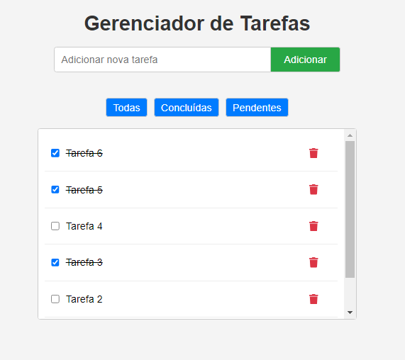

# Gerenciador de Tarefas


## Descrição do Projeto

O **Gerenciador de Tarefas** é uma aplicação web desenvolvida em React que permite aos usuários adicionar, visualizar, marcar como concluídas, excluir e filtrar tarefas de forma intuitiva. O objetivo é proporcionar uma interface amigável para o gerenciamento eficiente de atividades diárias.

## Funcionalidades

- **Adicionar Tarefas:** Permite ao usuário inserir novas tarefas na lista.
- **Listar Tarefas:** Exibe todas as tarefas adicionadas, com a opção de marcar como concluídas.
- **Excluir Tarefas:** Possibilita remover tarefas indesejadas da lista.
- **Filtrar Tarefas:** Oferece filtros para visualizar todas as tarefas, apenas as concluídas ou apenas as pendentes.
- **Estado Global:** Gerenciamento do estado global da aplicação utilizando `useContext` e `useReducer`.

## Layout da Aplicação



> *Nota: A imagem acima representa a interface atual da aplicação.*

## Tecnologias Utilizadas

- [React](https://pt-br.reactjs.org/)
- [JavaScript](https://developer.mozilla.org/pt-BR/docs/Web/JavaScript)
- [CSS](https://developer.mozilla.org/pt-BR/docs/Web/CSS)
- [React Icons](https://react-icons.github.io/react-icons/)

## Pré-requisitos

Antes de iniciar, certifique-se de ter o [Node.js](https://nodejs.org/) instalado em sua máquina.

## Como Rodar a Aplicação

1. **Clonar o Repositório:**

   ```bash
   git clone https://github.com/seu-usuario/gerenciador-de-tarefas.git
   ```

2. **Navegar até o Diretório do Projeto:**

   ```bash
   cd gerenciador-de-tarefas
   ```

3. **Instalar as Dependências::**
   ```bash
   npm install
   ```


4. **Iniciar a Aplicação:**
   ```bash
   npm start
   ```

### A aplicação estará disponível em: http://localhost:3000.